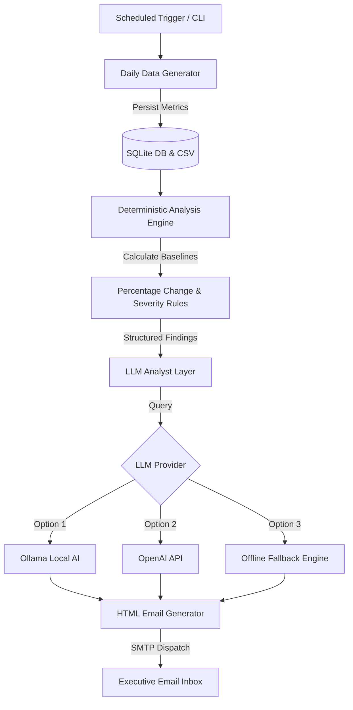

<div align="center">

# 📊 DhawalKart — AI-Powered Automated Daily Business Analyst

[](https://www.python.org/)
[](https://www.sqlite.org/)
[](https://ollama.com/)
[](https://github.com/features/actions)
[](LICENSE)

*An autonomous e-commerce daily business analyst system built from scratch for **DhawalKart**. Generates realistic metric streams, calculates multi-period baseline anomalies in Python, interprets findings with LLMs (Ollama / OpenAI), and dispatches executive HTML digests automatically every day.*

---

[Key Features](#-key-features) • [System Architecture](#-system-architecture) • [Getting Started](#-getting-started) • [Simulated Events](#-simulated-events) • [Cloud Automation](#-247-cloud-automation)

</div>

---

## 📖 Overview

**DhawalKart Business Analyst** bridges the gap between raw e-commerce operational data and actionable business intelligence. 

Instead of relying on machine-learning black boxes, the system calculates multi-period percentage changes (**Previous Day**, **7-Day Average**, and **30-Day Average**) deterministically in Python. These structured findings are then passed to an LLM Business Analyst, which acts as a senior business partner—writing executive summaries, explaining metric relationships, and recommending strategic next steps directly to your inbox.

```
DhawalKart Store Data ➔ Daily Generator ➔ SQLite / CSV Datastore ➔ Python Analysis Engine ➔ Rule Anomaly Classifier ➔ LLM Business Analyst ➔ Styled HTML Email Report
```

---

## ✨ Key Features

- **⚡ Deterministic Business Engine**: All mathematical calculations (vs Yesterday, 7-day average, 30-day average) are executed in pure Python—guaranteeing 100% factual accuracy without LLM calculation errors.
- **🎯 Rule-Based Anomaly Detection**: Configurable change thresholds (**±10% Noteworthy**, **±20% Significant**, **±30% Major**) classify metric movements dynamically.
- **🤖 Dual LLM Integration**: Supports local open-source models via **Ollama** (`llama3`, `mistral`) for $0 cost, **OpenAI API** (`gpt-4o-mini`), and an offline deterministic fallback.
- **📧 Executive HTML Email Reports**: Delivers responsive email digests with color-coded severity badges, formatted count metrics (integers without decimals), and clear section breakdowns.
- **⏰ 24/7 Cloud Automation**: Built-in GitHub Actions workflow (`daily_report.yml`) executes daily reports on cloud servers without needing your computer to stay on.
- **🧪 Business Event Simulator**: Built-in CLI generator for testing real-world business scenarios (`marketing_campaign`, `website_problem`, `payment_failure`, `product_quality_problem`, `successful_promotion`).
- **💾 Dual Storage Sync**: Seamlessly syncs daily metrics across **`business_data.csv`** and persistent **`business_data.db`** (SQLite).

---

## 🏗️ System Architecture



---

## 📈 Tracked Metrics & Consistency Rules

| Metric | Type | Unit | Formula / Relationship |
| :--- | :---: | :---: | :--- |
| **Website Traffic** | Count | Integer | Base volume with normal daily stochastic variation |
| **Orders** | Count | Integer | $\text{Orders} = \text{Traffic} \times \left(\frac{\text{Conversion Rate}}{100}\right)$ |
| **Conversion Rate** | Percentage | % | Bounded realistic variation (1.5% to 5.0%) |
| **Revenue** | Currency | ₹ (INR) | $\text{Revenue} = \text{Orders} \times \text{Average Order Value}$ |
| **Marketing Spend** | Currency | ₹ (INR) | Tied to daily traffic volume |
| **Operating Cost** | Currency | ₹ (INR) | Tied to gross revenue generated |
| **Refunds** | Count | Integer | Tied to order volume (1% to 4% base) |
| **New Customers** | Count | Integer | Tied to order volume (55% to 75% base) |

---

## 🚀 Getting Started

### 1. Prerequisites
- Python 3.12+
- Git

### 2. Installation & Setup

```bash
# Clone the repository
git clone https.github.com/DhawalDeshmukh72/Business_Analyzer.git
cd Business_Analyzer

# Install dependencies
pip install -r requirements.txt
```

### 3. Environment Configuration

Create a `.env` file in the project root:

```env
# LLM Provider Configuration (options: ollama, openai, fallback)
LLM_PROVIDER=ollama
OLLAMA_MODEL=llama3

# Optional OpenAI API Key
# OPENAI_API_KEY=sk-your-openai-api-key-here

# Email Configuration (SMTP)
SMTP_SERVER=smtp.gmail.com
SMTP_PORT=587
EMAIL_ADDRESS=your_sender_email@gmail.com
EMAIL_PASSWORD=your_16_character_app_password
RECIPIENT_EMAIL=your_recipient_email@gmail.com
```

---

## 💻 Running the Pipeline

### Standard Execution (Today's Report)
```bash
python main.py
```

### Run a Specific Date
```bash
python main.py --date 2026-08-16
```

### Reset 30-Day Baseline Dataset
```bash
python main.py --reset-data
```

---

## 🧪 Simulated Business Events

Test how the analysis engine and LLM react to operational anomalies using simulated business events:

| Event Command | Description & Metric Impact |
| :--- | :--- |
| `python main.py --date 2026-08-17 --event marketing_campaign` | Traffic +25% to +45%, Orders & Revenue Surge |
| `python main.py --date 2026-08-17 --event website_problem` | Traffic & Revenue Drop -30% to -50% |
| `python main.py --date 2026-08-17 --event payment_failure` | Traffic normal, Orders & Conversions Drop -50% |
| `python main.py --date 2026-08-17 --event product_quality_problem` | Refunds spike 3.5x to 6.0x normal rates |
| `python main.py --date 2026-08-17 --event successful_promotion` | Traffic +20-35%, Conversion Rate +20-40% |

---

## ☁️ 24/7 Cloud Automation (GitHub Actions)

This repository includes a pre-configured GitHub Actions workflow (`.github/workflows/daily_report.yml`) that runs the entire pipeline automatically in the cloud every day at **8:00 AM UTC**.

### Setup GitHub Secrets:
Go to your repository **Settings ➔ Secrets and variables ➔ Actions ➔ New repository secret**:

1. `EMAIL_ADDRESS`: Your sender Gmail address.
2. `EMAIL_PASSWORD`: Your 16-character Google App Password.
3. `RECIPIENT_EMAIL`: Target email inbox for receiving daily reports.
4. `OPENAI_API_KEY`: *(Optional)* If using OpenAI instead of Ollama/fallback.

---

## 📂 Repository Structure

```
Business_Analyzer/
├── .github/
│   └── workflows/
│       └── daily_report.yml       # GitHub Actions 24/7 cloud scheduler
├── daily_data_generator.py        # 30-day historical & daily row generator + event simulator
├── analysis_engine.py             # Deterministic baseline calculator & rule classifier
├── llm_analyst.py                 # LLM Analyst layer (Ollama / OpenAI / Fallback)
├── email_reporter.py              # Responsive HTML email reporter & SMTP dispatcher
├── database.py                    # SQLite persistent datastore module
├── main.py                        # Master pipeline orchestrator & CLI
├── business_data.csv              # CSV datastore
├── business_data.db               # SQLite database file
├── .env.example                   # Environment variable template
└── requirements.txt               # Python package dependencies
```

---

## 🛡️ License

Distributed under the MIT License. See `LICENSE` for details.

<div align="center">
  <sub>Built with ❤️ for <strong>DhawalKart</strong></sub>
</div>
